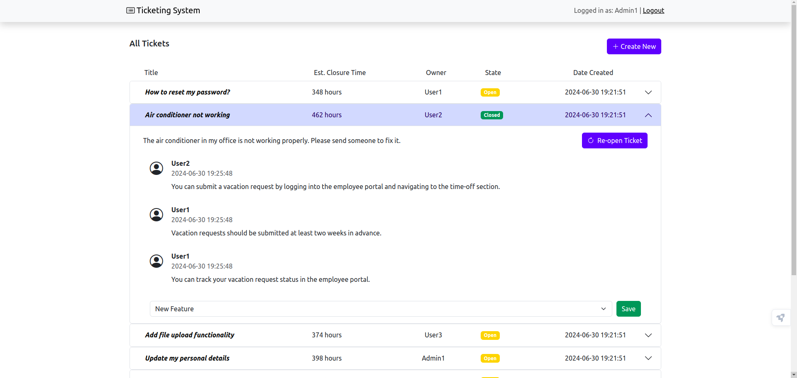

# Exam #1: "Ticketing System"

## Student: s322877 FALLAHI SEYED KASRA

## React Client Application Routes

- Route `/`: Home page, shows the list of all tickets. Logged in users can also see and edit the tickets(based on their privilage).
- Route `/login`: Login form, allows users to login. After a successful login, the user is redirected to the main route ("/").
- Route `/create-ticket`: Ticket creation form, allows logged in and admin users to create a new ticket. After successful submission, the user is redirected to the main route ("/").
- Route `*`: Page for nonexisting URLs (_Not Found_ page) that redirects to the home page.

## API Server

- **GET `/api/tickets`**: Get all the tickets as a JSON list.

  - **Response body**: JSON object with the list of tickets, or description of the error(s):
    ```
    [
      {
        "ticket_id": 1,
        "state": "Open",
        "category": "inquiry",
        "title": "Example Ticket",
        "initial_text": "This is an example ticket.",
        "submitted_at": "2024-06-29T12:34:56.000Z",
        "owner": "John Doe",
        "owner_id": 1,
        "text_blocks": [
          {
            "text_block_id": 1,
            "text": "This is an example text block.",
            "author": "John Doe",
            "submitted_at": "2024-06-29T13:34:56.000Z"
          }
        ]
      },
      ...
    ]
    ```
  - Codes: `200 OK`, `500 Internal Server Error`.

- **POST `/api/create-ticket`**: Create a new ticket for the currently logged in user.

  - **Request body**: JSON object with the ticket details:
    ```
    {
      "category": "inquiry",
      "title": "New Ticket",
      "description": "Description of the new ticket."
    }
    ```
  - **Response body**: Empty on success, or a JSON object with error description.
  - Codes: `200 OK`, `400 Bad Request` (invalid request body), `401 Unauthorized`, `500 Internal Server Error`.

- **PATCH `/api/ticket/:id`**: Edit the state or category of an existing ticket for the currently logged-in user.

  - **Request body**: JSON object with the new state or category. Only one of the fields (either `state` or `category`) is required:
    ```
    {
      "state": "Closed"
    }
    ```
    or
    ```
    {
      "category": "maintenance"
    }
    ```
  - **Response body**: Empty on success, or a JSON object with error description.
  - Codes: `200 OK`, `400 Bad Request` (invalid request body), `401 Unauthorized`, `500 Internal Server Error`.

- **POST `/api/ticket/:id/text-block`**: Add a text block to an existing ticket for the currently logged-in user.

  - **Request body**: JSON object with the text block content:
    ```
    {
      "text": "This is a new text block."
    }
    ```
  - **Response body**: Empty on success, or a JSON object with error description.
  - Codes: `200 OK`, `400 Bad Request` (invalid request body), `401 Unauthorized`, `500 Internal Server Error`.

  ### Authentication APIs

* **POST `/api/session`**: Authenticate and login the user.

  - **Request body**: JSON object with username and password:
    ```
    {
      "username": "user@example.com",
      "password": "password"
    }
    ```
  - **Response body**: JSON object with the user's info on success, or a JSON object with error description:
    ```
    {
      "id": 1,
      "email": "user@example.com",
      "name": "John Doe"
    }
    ```
  - Codes: `200 OK`, `400 Bad Request` (invalid request body), `401 Unauthorized`, `500 Internal Server Error`.

* **DELETE `/api/session`**: Logout the user.

  - **Response body**: Empty on success, or a JSON object with error description.
  - Codes: `200 OK`, `401 Unauthorized`.

* **GET `/api/auth-token`**: Get an auth token for the logged in user.
  - **Response body**: JSON object with the token.
    ```
    {
      "token": "jwt-token-here"
    }
    ```
  - **Token payload**:
    ```
    {
      "userId": 1
    }
    ```
  - Codes: `200 OK`, `401 Unauthorized`.

## API Server2

- **POST `/api/estimate-time`**: Returns the estimated time to close a ticket based on its title and category.

  - **Request Headers**: JWT token
  - **Request**: JSON object with the ticket title and category
    ```
    {
      "title": "Issue with login",
      "category": "Technical Issue"
    }
    ```
  - **Response body**: JSON object with the estimated time in hours for admin users or days for regular users
    - For admin users:
      ```
      {
        "estimatedHours": 50
      }
      ```
    - For regular users:
      ```
      {
        "estimatedDays": 3
      }
      ```
  - Codes: `200 OK`, `401 Unauthorized`, `400 Bad Request` (invalid request body).

- **POST `/api/estimate-times`**: Returns the estimated time to close multiple tickets based on their titles and categories.
- **Request Headers**: JWT token
- **Request**: JSON object with an array of tickets, each containing the title and category
  ```
  {
    "tickets": [
      { "title": "Issue with login", "category": "Technical Issue" },
      { "title": "Feature request: Dark mode", "category": "New Feature" }
    ]
  }
  ```
- **Response body**: JSON array with the estimated time in hours for each ticket
  ```
  [
    { "estimatedHours": 50 },
    { "estimatedHours": 120 }
  ]
  ```
- Codes: `200 OK`, `401 Unauthorized`, `400 Bad Request` (invalid request body).

## Database Tables

- Table `users`: _user_id_, _is_admin_, _email_, _name_, _hash_, _salt_.  
  _is_admin_: 0 for regular users, 1 for admin users.
- Table `tickets`: _ticket_id_, _owner_, _state_, _category_, _title_, _initial_text_, _submitted_at_.  
  _state_: Default is 'Open'.  
  _owner_: References the `user_id` in the `users` table.

- Table `text_blocks`: _text_block_id_, _ticket_id_, _text_, _author_, _submitted_at_.  
  _ticket_id_: References the `ticket_id` in the `tickets` table.  
  _author_: References the `user_id` in the `users` table.

## Main React Components

- `Main` (in `App.js`): technically a component, takes the role of App and is rendered inside a Router to be able to use the useNavigate hook. This maintains most of the state of the app.
- `HomePage` (in `App.js`): proper home page, contains the list of tickets and, when a user is logged in, their relevant actions as well. This component injects all the Contexts used throughout the app with their respective values.
- `TicketList` (in `TicketList.js`): the list of all tickets. It conditionally renders tickets in an accordion for logged-in users or as a card list for guests.
- `TicketItem` (in `TicketList.js`): a single ticket in the TicketList. Displays ticket information and, when expanded, shows ticket details and actions for logged-in users.
- `TicketItemDetails` (in `TicketItemDetails.js`): detailed view of a ticket, including actions to add replies and change ticket state. It also includes the category editing functionality for admin users.
- `GeneralTicketItem` (in `TicketList.js`): a single ticket displayed as a card for guests without user-related functionalities.
- `TextBlockList` (in `TicketItemDetails.js`): renders the list of text blocks (replies) for a ticket.
- `AdminCategoryEdit` (in `TicketItemDetails.js`): allows admin users to edit the category of a ticket.
- `TicketActions` (in `TicketItemDetails.js`): renders ticket actions like close and reopen for logged-in users.
- `LoginForm` (in `LoginForm.js`): the login form that users can use to log into the app. This is responsible for the client-side validation of the login credentials (valid email and non-empty password).
- `CreateTicketForm` (in `CreateTicketForm.js`): the form used to create a new ticket. This includes fields for the ticket's title, category, and description, and handles form validation and submission.

## Screenshot




## Users Credentials

| email   | password | name   | is_admin |
| ------- | -------- | ------ | -------- |
| u1@p.it | password | User1  | 0        |
| u2@p.it | password | User2  | 0        |
| u3@p.it | password | User3  | 0        |
| a1@p.it | password | Admin1 | 1        |
| a2@p.it | password | Admin2 | 1        |
