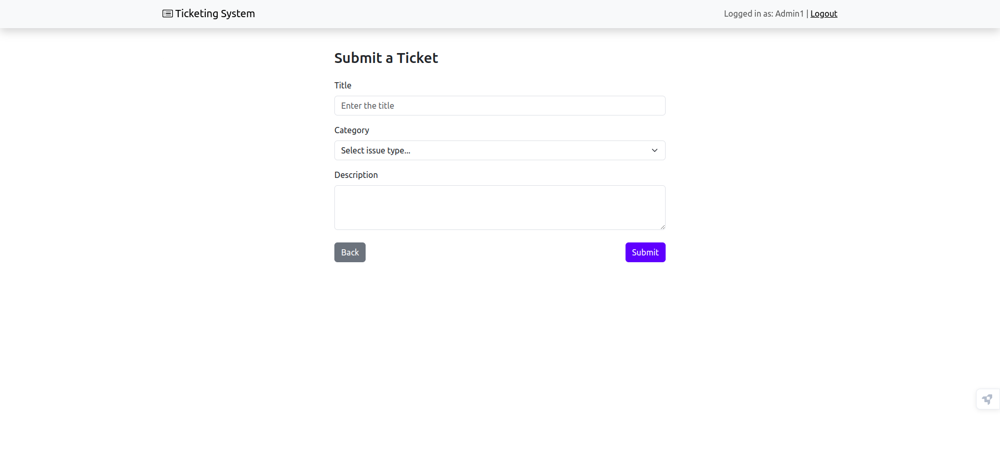

# Ticket Management Application

A web application to manage tickets with different user roles (regular users and admins). It consists of a **React Client Application** for the frontend and an **API Server** for the backend.

---

## React Client Application Routes

- **`/`**: Home page displaying a list of all tickets.  
  - Logged-in users can view and edit tickets based on their privileges.

- **`/login`**: Login form.  
  - After successful login, users are redirected to the home page.

- **`/create-ticket`**: Ticket creation form.  
  - Allows logged-in admin users to create new tickets. After submission, the user is redirected to the home page.

- **`*`**: Catch-all route for non-existing URLs.  
  - Redirects to the home page with a "Not Found" message.

---

## API Server

### **Ticket APIs**

1. **`GET /api/tickets`**  
   Retrieve all tickets as a JSON list.  
   - **Response**: JSON array of tickets or error description.  
   - **Status Codes**: `200 OK`, `500 Internal Server Error`.

2. **`POST /api/create-ticket`**  
   Create a new ticket for the logged-in user.  
   - **Request Body**:
     ```json
     {
       "category": "inquiry",
       "title": "New Ticket",
       "description": "Description of the new ticket."
     }
     ```
   - **Response**: Empty on success or error description.  
   - **Status Codes**: `200 OK`, `400 Bad Request`, `401 Unauthorized`, `500 Internal Server Error`.

3. **`PATCH /api/ticket/:id`**  
   Edit the state or category of an existing ticket.  
   - **Request Body** (either `state` or `category` is required):
     ```json
     { "state": "Closed" }
     ```
     or
     ```json
     { "category": "maintenance" }
     ```
   - **Response**: Empty on success or error description.  
   - **Status Codes**: `200 OK`, `400 Bad Request`, `401 Unauthorized`, `500 Internal Server Error`.

4. **`POST /api/ticket/:id/text-block`**  
   Add a text block to a ticket.  
   - **Request Body**:
     ```json
     { "text": "This is a new text block." }
     ```
   - **Response**: Empty on success or error description.  
   - **Status Codes**: `200 OK`, `400 Bad Request`, `401 Unauthorized`, `500 Internal Server Error`.

---

### **Authentication APIs**

1. **`POST /api/session`**  
   Login and authenticate the user.  
   - **Request Body**:
     ```json
     {
       "username": "user@example.com",
       "password": "password"
     }
     ```
   - **Response**: User info on success or error description.  
   - **Status Codes**: `200 OK`, `400 Bad Request`, `401 Unauthorized`, `500 Internal Server Error`.

2. **`DELETE /api/session`**  
   Logout the user.  
   - **Response**: Empty on success or error description.  
   - **Status Codes**: `200 OK`, `401 Unauthorized`.

3. **`GET /api/auth-token`**  
   Retrieve an authentication token for the logged-in user.  
   - **Response**:
     ```json
     { "token": "jwt-token-here" }
     ```
   - **Status Codes**: `200 OK`, `401 Unauthorized`.

---

### **Advanced APIs**

1. **`POST /api/estimate-time`**  
   Estimate the time to close a ticket.  
   - **Request Body**:
     ```json
     {
       "title": "Issue with login",
       "category": "Technical Issue"
     }
     ```
   - **Response** (Admin: hours, Regular users: days):
     ```json
     { "estimatedHours": 50 }
     ```
     or
     ```json
     { "estimatedDays": 3 }
     ```
   - **Status Codes**: `200 OK`, `401 Unauthorized`, `400 Bad Request`.

2. **`POST /api/estimate-times`**  
   Estimate the time to close multiple tickets.  
   - **Request Body**:
     ```json
     {
       "tickets": [
         { "title": "Issue with login", "category": "Technical Issue" },
         { "title": "Feature request: Dark mode", "category": "New Feature" }
       ]
     }
     ```
   - **Response**:
     ```json
     [
       { "estimatedHours": 50 },
       { "estimatedHours": 120 }
     ]
     ```
   - **Status Codes**: `200 OK`, `401 Unauthorized`, `400 Bad Request`.

---

## Database Schema

### Tables

1. **Users**
   - Columns: `user_id`, `is_admin`, `email`, `name`, `hash`, `salt`.  
   - **`is_admin`**: 0 for regular users, 1 for admins.

2. **Tickets**
   - Columns: `ticket_id`, `owner`, `state`, `category`, `title`, `initial_text`, `submitted_at`.  
   - **`state`**: Default is "Open".  
   - **`owner`**: References `user_id` in `users`.

3. **Text Blocks**
   - Columns: `text_block_id`, `ticket_id`, `text`, `author`, `submitted_at`.  
   - **`ticket_id`**: References `ticket_id` in `tickets`.  
   - **`author`**: References `user_id` in `users`.

---

## Main React Components

1. **Main (App.js)**: Maintains app state and routing.  
2. **HomePage (App.js)**: Displays tickets and actions for logged-in users.  
3. **TicketList (TicketList.js)**: List of all tickets.  
4. **TicketItem (TicketList.js)**: Displays ticket info and actions.  
5. **TicketItemDetails (TicketItemDetails.js)**: Detailed ticket view with actions.  
6. **TextBlockList (TicketItemDetails.js)**: Renders ticket replies.  
7. **AdminCategoryEdit (TicketItemDetails.js)**: Allows admins to edit ticket categories.  
8. **LoginForm (LoginForm.js)**: Login form with validation.  
9. **CreateTicketForm (CreateTicketForm.js)**: Form for creating new tickets.

---

## Users Credentials

| Email    | Password | Name   | Role    |
| -------- | -------- | ------ | ------- |
| u1@p.it  | password | User1  | Regular |
| u2@p.it  | password | User2  | Regular |
| u3@p.it  | password | User3  | Regular |
| a1@p.it  | password | Admin1 | Admin   |
| a2@p.it  | password | Admin2 | Admin   |

---

## Screenshots

### Ticket List


### Submission Form

